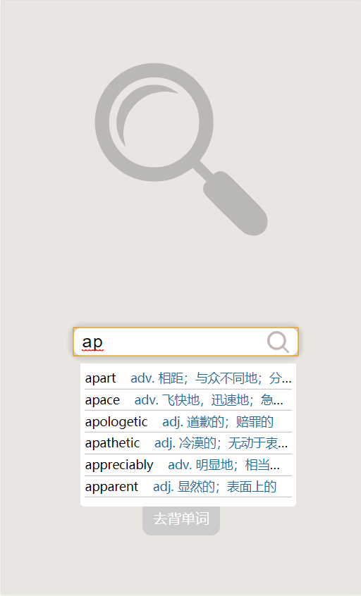
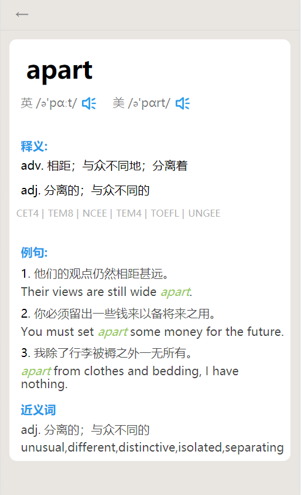
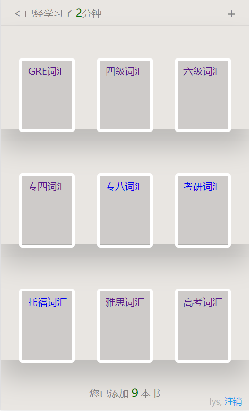
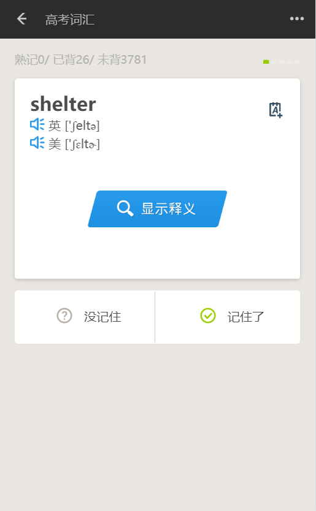
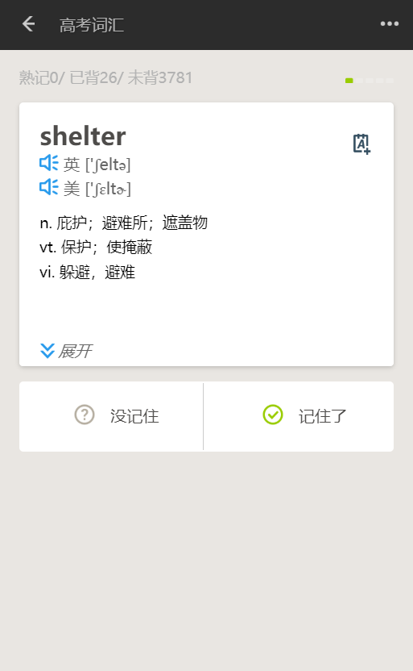
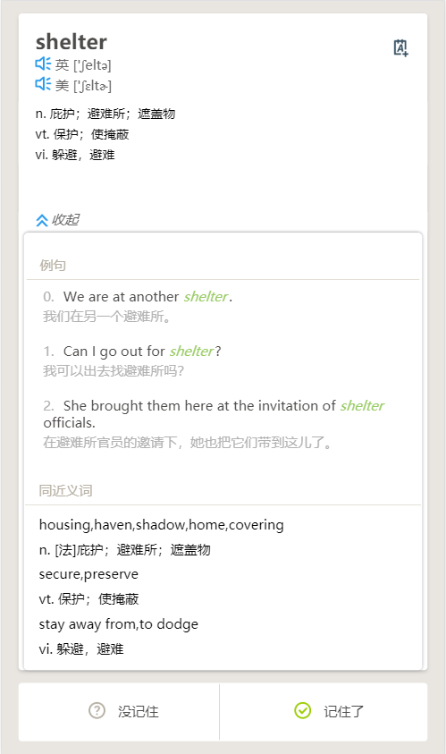
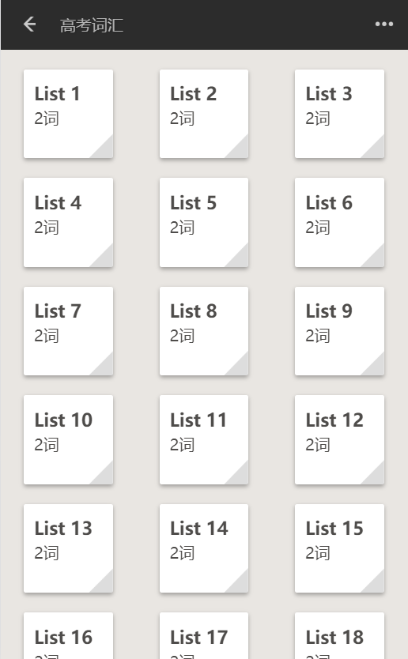
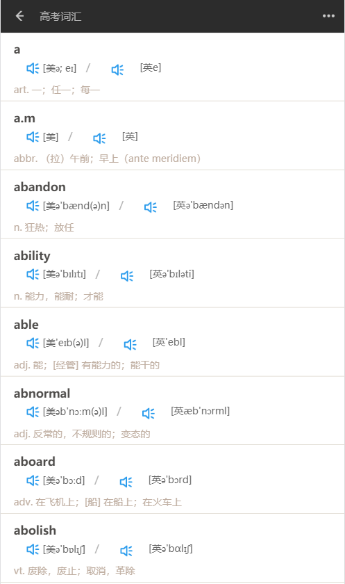

# Recite_words📚

<i>Vue + Flask + Nginx + Uwsgi + Supervisor</i>

   
<a href='#downloading'>下载与试用🔍</a>

# Overview

这是一个用于背诵和查询单词的软件,使用Flask和Vue开发 :

- 运行系统 : CentOS
- 服务器部署 : Nginx + Uwsgi

- Web框架 : Flask

- 数据库 : [MongoDB](./docs/MongoDB.md)
- 前端框架 : [Vue](https://github.com/lysfighting/recite_word)
- 进程管理 : Supervisor

# Demo
- 主页面

- 查询单词-预览

- 查询单词-详情

- 词汇分类

- 词汇背诵主界面

- 背诵单词

- 词汇表

- 单词本

# Features

- 用户注册登录
- 单词的精确查询, 模糊查询, 预览查询结果
- 记录每次的学习时间, 看到自己的进步
- 提供9大分类
  - 四级 - CET4
  - 六级 - CET6
  - 专四 - TEM4
  - 专八 - TEM8
  - 高考 - NCEE
  - 考研 - UNGEE
  - 雅思 - IELTS
  - 托福 - TOEFL

- 单词背诵
  - 乱序背诵 - 艾宾诺斯遗忘曲线发
    - 提供'记住了', '没记住', 用于控制单词出现概率的权重
    - 随时根据单词掌握情况查看释义: '显示释义', '展开释义'
    - 随时添加单词本, 以待后续自行复习
  - 顺序背诵 - a~z
  - 单词本
    - 查看记录的单词

# Q & A

下面记录了一些在项目开发和部署过程中遇到的问题以及解决办法

1. 为什么使用Flask作为后端框架

   <i>单词数据类型是对象的形式, 考虑到这一点, **json**是一个很合适的前后端交互数据类型, **Django-rest-framework**和**Flask**作为备选项, Flask更加轻便、灵活,也就更加适合这个小项目</i>

2. 如何制作二维码

   *联图二维码开放平台提供了免费的API:point_right:：http://www.liantu.com/pingtai/*

   | 参数 |        描述        |                           赋值例子                           |
   | :--: | :----------------: | :----------------------------------------------------------: |
   |  bg  |      背景颜色      |                 bg=颜色代码，例如：bg=ffffff                 |
   |  fg  |      前景颜色      |                 fg=颜色代码，例如：fg=cc0000                 |
   |  gc  |      渐变颜色      |                gc=颜色代码，例如：gc=cc00000                 |
   |  el  |      纠错等级      |                el可用值：h\q\m\l，例如：el=h                 |
   |  w   |      尺寸大小      |                 w=数值（像素），例如：w=300                  |
   |  m   |   静区（外边距）   |                  m=数值（像素），例如：m=30                  |
   |  pt  | 定位点颜色（外框） |                 pt=颜色代码，例如：pt=00ff00                 |
   | inpt | 定位点颜色（内点） |               inpt=颜色代码，例如：inpt=000000               |
   | logo |      logo图片      | logo=图片地址，例如：logo=http://www.liantu.com/images/2013/sample.jpg |

   *此app的二维码由`http://qr.topscan.com/api.php?text=http://39.106.97.135:9527/download&`*

   *`logo=http://39.106.97.135:80/logo/dictionary.png`生成*

   *text：Flask代码中定义的接口`/download*`*，logo：Nginx管理的静态图片资源--app的logo*

3. 下载接口如何实现

   *使用Flask提供的send_file函数，去指定的路径中读取并发送文件，其中`as_attachment=True`参数可以添加文件描述的请求头例如：`Content-Disposition: attachment; filename=recite_words.apk*`

   :point_right:[代码详情](./app/download.py)

   |        参数         |                             说明                             |
   | :-----------------: | :----------------------------------------------------------: |
   |   filename_or_fp    |                        需要发送的文件                        |
   |      mimetype       | the mimetype of the file if provided. If a file path is given, auto detection happens as fallback, otherwise an error will be raised. |
   |    as_attachment    | et to True if you want to send this file with a Content-Disposition: attachment header. |
   | attachment_filename | the filename for the attachment if it differs from the file’s filename. |
   |      add_etags      |         set to False to disable attaching of etags.          |
   |     conditional     |         set to True to enable conditional responses.         |
   |    cache_timeout    |           the timeout in seconds for the headers.            |
   |    last_modified    |                                                              |

# Downloading

:iphone:下载手机app：​

- Android​ ：          </img>

- ~~iOS~~：暂未开放

:earth_asia:试用网页版：[点击使用](http://39.106.97.135:5001)